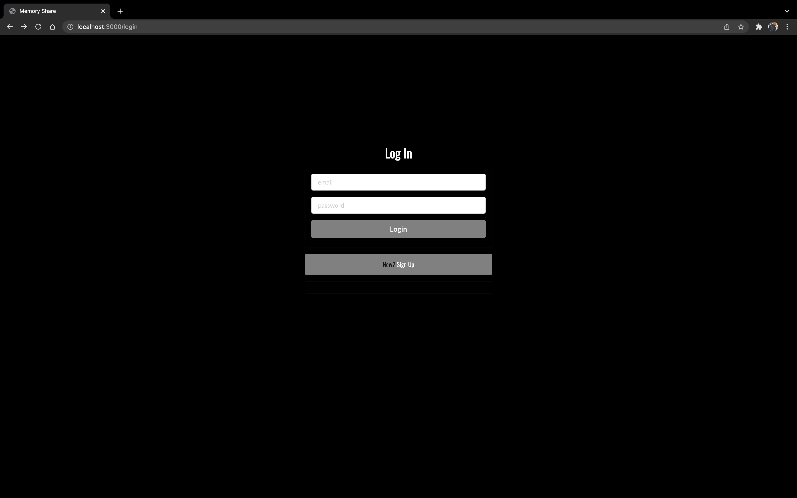
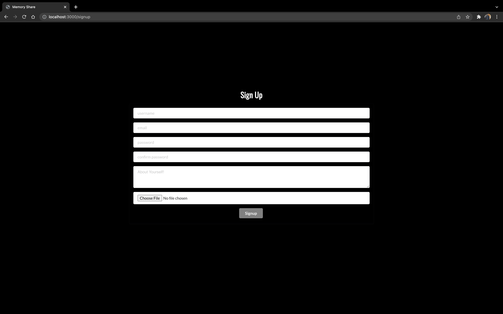
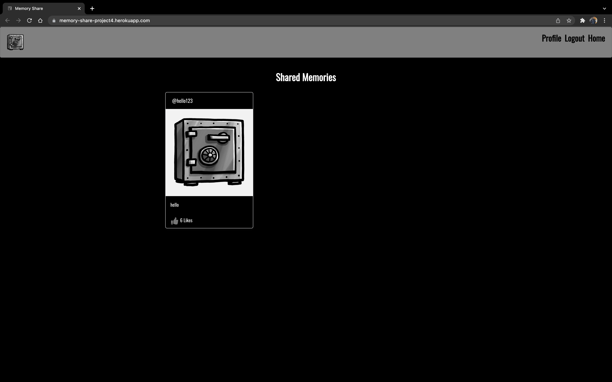
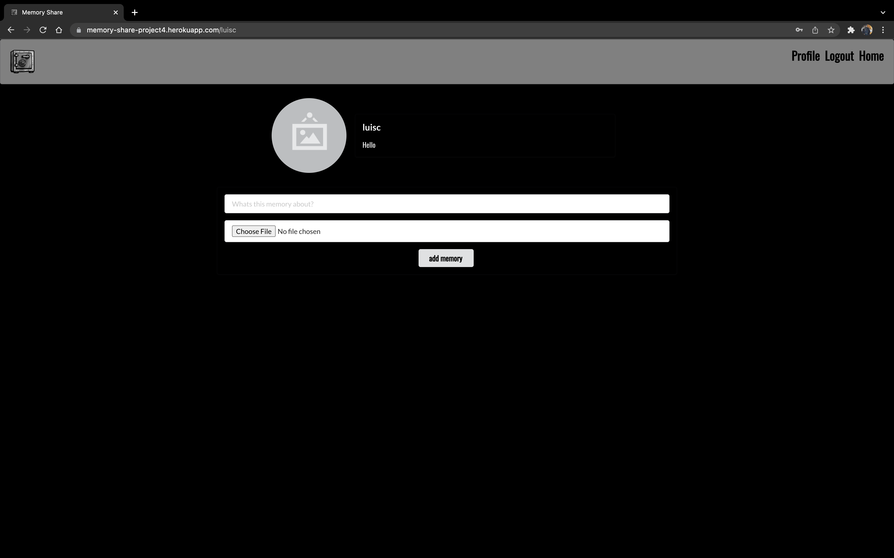

# Memory App
### This app is used to share memories with others and can also be used to post pictures that you dont want to lose. All users must signup to be able to see the shared memories.

### Log In Page
**Has to sign up**

### Sign Up Page

### Home Page
**Has to be logged in to see**

### Profile Page
**Has to be logged in to see**

### Technologies Used
- Node.js
- Express
- Semantic UI React
- Heroku
- JWT 
- React

### Get Started
Click [here](https://memory-share-project4.herokuapp.com/login) to launch the app.

My Trello is [here](https://trello.com/b/xOW7XxXv/project-4) with ERD and Wireframes.

### Icebox Features
- AAU, I want to delete my post.
- AAU, I want to have an option where I can choose to set my memories either private or public.
